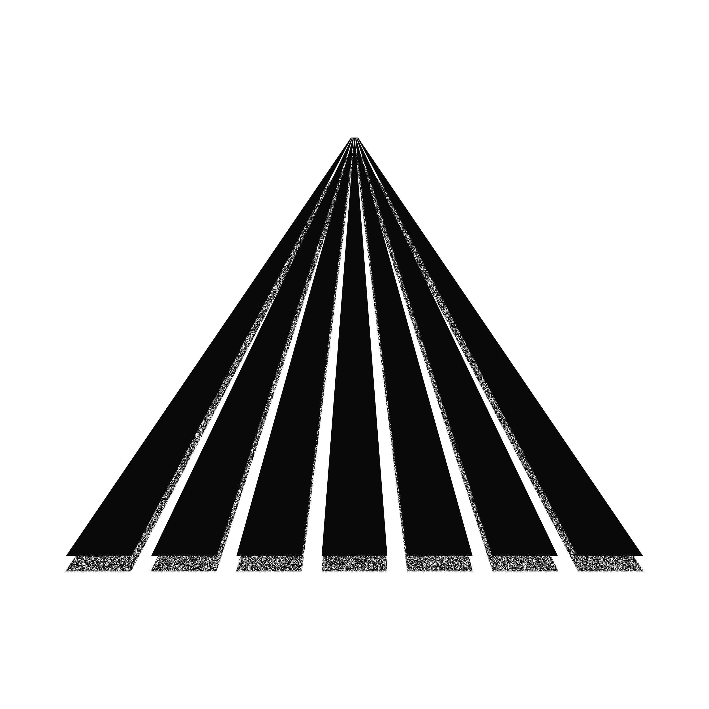

<div align="center">
  

  # cascade
  ### auto-switching AI CLI chat for as many free-tiers as you like.
</div>

---

a single, dependency-free python script that turns free-tier
API keys into one always-on chat endpoint.

 It discovers every free model across
your connected providers, ranks them **best → worst**, and routes each message to
the best available one. 

When a model runs out of usage (rate limit / quota), it
**automatically fails over** to the next best model and retries — so you keep going
without touching anything.

## Provider catalog (~18 providers)

Every provider is OpenAI-compatible and **auto-enables when its key is in `.env`**.
Sourced from [free-ai-tools](https://github.com/ShaikhWarsi/free-ai-tools).

| Provider | Env var | Notable free limit | Get a key |
| --- | --- | --- | --- |
| **Groq** | `GROQ_KEY` | ~1,000 req/day per model | [console.groq.com](https://console.groq.com) |
| **Cerebras** | `CEREBRAS_KEY` | 30 RPM · 1M tokens/day (fastest) | [cloud.cerebras.ai](https://cloud.cerebras.ai/) |
| **Google Gemini** | `GEMINI_KEY` | 250–1,500 req/day | [aistudio.google.com](https://aistudio.google.com) |
| **Mistral** | `MISTRAL_KEY` | 1 req/s · 1B tok/month | [console.mistral.ai](https://console.mistral.ai/) |
| **SambaNova** | `SAMBANOVA_KEY` | $5 trial / 3 mo | [cloud.sambanova.ai](https://cloud.sambanova.ai/) |
| **Nvidia NIM** | `NIM_KEY` | 40 RPM · 1K–5K credits | [build.nvidia.com](https://build.nvidia.com) |
| **Cloudflare** | `CF_ACC_ID` + `CF_API_TOKEN` | 10,000 neurons/day | [developers.cloudflare.com/workers-ai](https://developers.cloudflare.com/workers-ai) |
| **OpenRouter** | `OR_KEY` | 20 RPM · 50–1,000 req/day (`:free` only) | [openrouter.ai](https://openrouter.ai) |
| **OVHcloud** | *(none — keyless!)* | 2 RPM with no key at all | [endpoints.ai.cloud.ovh.net](https://endpoints.ai.cloud.ovh.net) |
| **Scaleway** | `SCALEWAY_KEY` | 1M tokens | [console.scaleway.com](https://console.scaleway.com/generative-api/models) |
| **Nebius** | `NEBIUS_KEY` | $1 trial (permanent) | [tokenfactory.nebius.com](https://tokenfactory.nebius.com/) |
| **Hyperbolic** | `HYPERBOLIC_KEY` | $1 trial | [app.hyperbolic.ai](https://app.hyperbolic.ai/) |
| **DeepInfra** | `DEEPINFRA_KEY` | 200 concurrent | [deepinfra.com](https://deepinfra.com/login) |
| **Fireworks** | `FIREWORKS_KEY` | $1 trial (permanent) | [fireworks.ai](https://fireworks.ai/) |
| **Novita** | `NOVITA_KEY` | $0.50 trial / 1 yr | [novita.ai](https://novita.ai/) |
| **SiliconFlow** | `SILICONFLOW_KEY` | 1K RPM · 50K TPM | [cloud.siliconflow.cn](https://cloud.siliconflow.cn/account/ak) |
| **Z.AI (GLM)** | `ZAI_KEY` | free tier (generous) | [z.ai](https://z.ai) |
| **Chutes AI** | `CHUTES_KEY` | community GPU | [chutes.ai](https://chutes.ai) |

Run `/providers` (or `python3 cascade.py --providers`) to see which are connected and
the exact env var + signup link for each one you can still add. Add a key, run
`/refresh`, and that provider's models join the leaderboard instantly. **OVHcloud
works with no key at all**, so the app has models even with an otherwise empty `.env`.

## Setup

Add any subset of the keys above to `.env` in this folder. No `pip install` needed
(Python 3 standard library only).

## Usage

```bash
python3 cascade.py            # interactive chat with auto-routing
python3 cascade.py --list     # ranked leaderboard
python3 cascade.py --providers# provider catalog (connected + addable)
python3 cascade.py --bench    # race top models for latency + tokens/sec
python3 cascade.py -q "..."   # one-shot prompt
python3 cascade.py --serve    # run as an OpenAI-compatible REST API (see below)
```

### In-chat commands

| command         | what it does                                            |
| --------------- | ------------------------------------------------------- |
| `/models`       | ranked leaderboard (best → worst) with live status      |
| `/providers`    | catalog: connected providers + ones you can unlock      |
| `/usage`        | daily budget bars + live rate-limit snapshots           |
| `/bench`        | race top models, measure real latency + tokens/sec      |
| `/fastest`      | re-rank by measured speed (run `/bench` first)          |
| `/quality`      | restore the quality (best → worst) ranking              |
| `/use <n>`      | pin to leaderboard index `n` (turn off auto-routing)    |
| `/auto`         | resume automatic best-available routing                 |
| `/system <txt>` | set a system prompt                                     |
| `/clear`        | clear conversation history                              |
| `/refresh`      | re-discover models & reset transient cooldowns          |
| `/help`         | command list                                            |
| `/quit`         | exit                                                    |

## Server mode — one unified API

Run cascade as a long-lived HTTP server and it becomes a single
**OpenAI-compatible** endpoint in front of every provider. Same discovery,
ranking, and auto-failover as the CLI — just RESTful, so any existing OpenAI
client/SDK can use all ~18 free tiers as one API with automatic failover.

```bash
python3 cascade.py --serve                  # http://127.0.0.1:8000
python3 cascade.py --serve --host 0.0.0.0 --port 9000
```

Config via flags or env: `--host`/`CASCADE_HOST`, `--port`/`CASCADE_PORT`. Set
`CASCADE_API_KEY` to require an `Authorization: Bearer <key>` on requests
(otherwise any key is accepted, since the server is meant to run locally).

### Endpoints

| method & path | what it does |
| --- | --- |
| `POST /v1/chat/completions` | OpenAI chat completions — auto-routed with failover. `stream: true` supported. |
| `GET /v1/models` | discovered models as OpenAI model objects, plus the `auto` meta-model |
| `GET /v1/providers` | per-provider status, limits, signup links, requests today |
| `POST /v1/refresh` | re-discover models & clear transient cooldowns (like `/refresh`) |
| `GET /health` | liveness + provider/model summary |

The `model` field picks the routing strategy:

- `"auto"` (or omit it) → best available model, fail over down the leaderboard.
- `"<provider>/<model>"` (e.g. `groq/openai/gpt-oss-120b`, from `/v1/models`) →
  pin to that exact model.
- a bare model id present on several providers → any provider offering it,
  best-first, with failover between them.

### Use it from anything

```bash
# curl
curl http://127.0.0.1:8000/v1/chat/completions \
  -H 'Content-Type: application/json' \
  -d '{"model":"auto","messages":[{"role":"user","content":"hello"}]}'
```

```python
# OpenAI Python SDK — just change base_url
from openai import OpenAI
client = OpenAI(base_url="http://127.0.0.1:8000/v1", api_key="not-needed")
r = client.chat.completions.create(
    model="auto",                                  # or a specific provider/model id
    messages=[{"role": "user", "content": "hello"}],
    stream=True,
)
for chunk in r:
    print(chunk.choices[0].delta.content or "", end="", flush=True)
```

Successful responses include a non-standard `cascade` field naming the
`provider`/`model` that actually served the request and any failover `attempts`,
so you can see what routing did.

## How ranking works

Each discovered model is scored by **family** (DeepSeek / Nemotron / Llama / Qwen /
GLM / Kimi / GPT-OSS …), **parameter size**, and a small **provider-speed** tiebreak
(Cerebras/Groq first). The 70–200B range is treated as the free-tier sweet spot;
models ≥300B are penalised because on free tiers they are the slowest and most
rate-limited (use `/bench` + `/fastest` if you want one anyway). The chat is sent to
the highest scorer that is currently `✓ ready`; anything on `⏳ cooldown` or `✗ down`
is skipped.

## /bench — empirical speed race

Fires one tiny prompt at the top available models **concurrently**, measures
first-token latency (TTFT) and tokens/sec, and prints a sorted table. `/fastest`
then re-ranks the whole leaderboard by measured throughput, so you can route for
speed instead of raw quality. Great for finding the fastest model that's actually up.

## Failover triggers

| signal                        | action                                            |
| ----------------------------- | ------------------------------------------------- |
| HTTP 429 / "rate limit"       | cooldown until the provider's reset, try next     |
| HTTP 402 / quota / credit     | long cooldown (persisted), try next               |
| HTTP 401 / 403                | provider disabled (bad key)                        |
| HTTP 400 / 404 / 422          | that model marked unsupported, try next            |
| 5xx / network / timeout       | short cooldown, try next                            |

## Usage tracking

- **Daily budget bars** — documented free limits (e.g. Groq ~1,000 req/day,
  Cloudflare 10K neurons/day) shown against locally-counted requests, persisted per
  day to `~/.cascade_state.json`. Long cooldowns (quota exhaustion) persist too, so a
  model that's tapped out stays skipped across restarts until its reset.
- **OpenRouter** — live tier + daily spend via its `auth/key` endpoint.
- **Groq** — live remaining requests/tokens from response headers.
- Others have no usage API and simply fail over on 429/quota.
